# 麻辣任務 — 玩家使用教學

朋友們被隨機分到「四川」或「重慶」，各自挑一間當地餐廳推薦，最後投票決定去哪間吃！

---

## 1. 登入

用 Google 帳號登入即可開始使用。

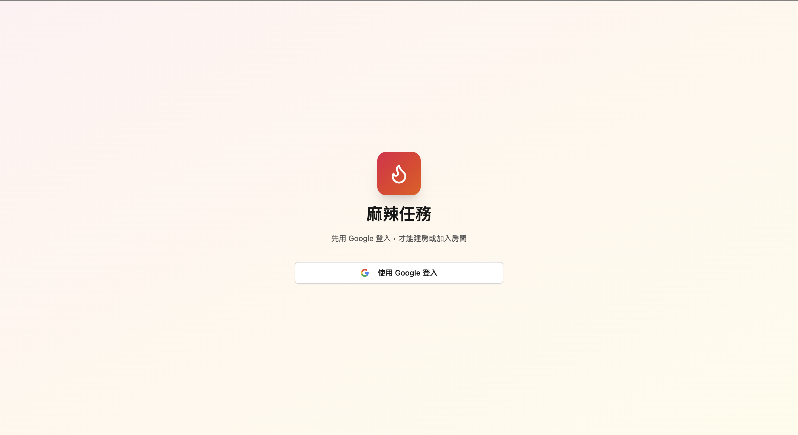

---

## 2. 建立房間

輸入房間標題（例如「週五聚餐」）和參與人數（2～12 人），點擊「建立房間」。
房主可以在等待頁面底部找到「刪除房間」按鈕，刪除後所有資料會永久消失。

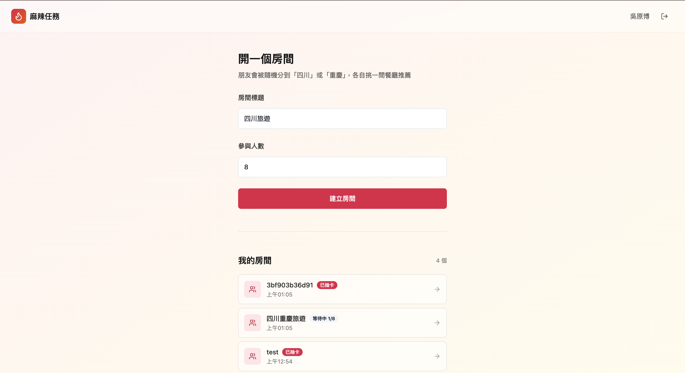

---

## 3. 邀請朋友

建好房間後會看到邀請連結，複製連結傳給朋友，他們登入後即可加入。滿員後自動開始抽卡

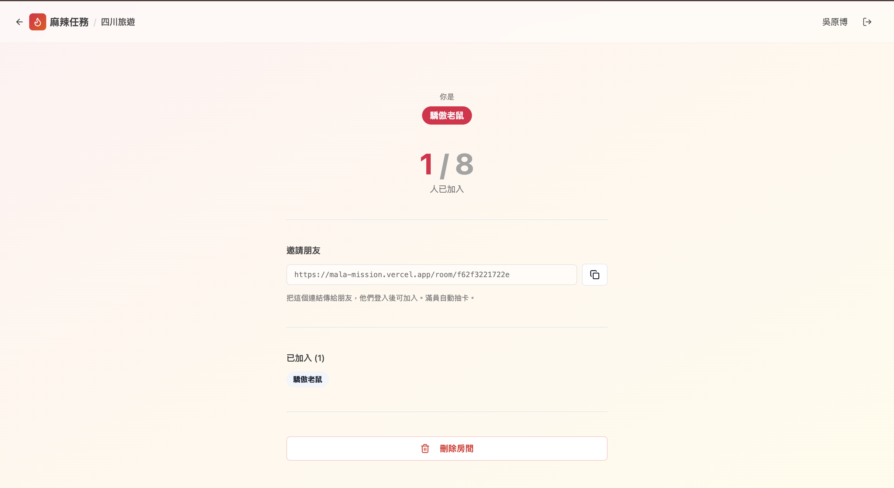

---

## 4. 翻卡揭曉城市

點擊卡牌翻面，看看你被分到哪個城市！

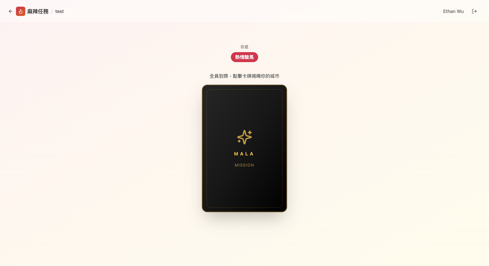

---

## 5. 提交餐廳

在你被分到的城市範圍內，找一間餐廳推薦給大家。填寫餐廳名稱、Google Maps 連結，以及推薦菜色（選填）。

> 不知道怎麼取得 Google Maps 連結？點擊輸入框旁邊的 **?** 按鈕，裡面有圖文教學。

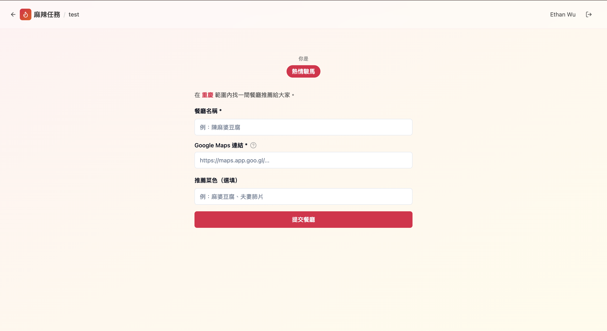

---

## 6. 投票

所有人都提交後進入投票階段。你有固定的星星點數，分配給你想去的餐廳（不能投給自己）。

- **手機**：左右滑動切換卡片，點右上角星星投票
- **電腦**：橫向排列所有卡片，直接點星星

點擊卡片可以打開詳細資訊，查看 Google Maps 位置。

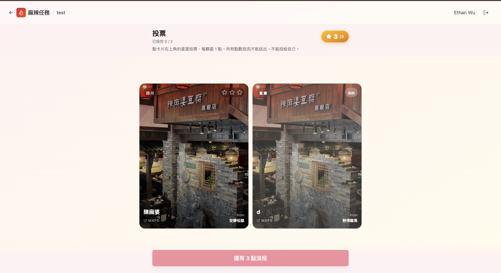

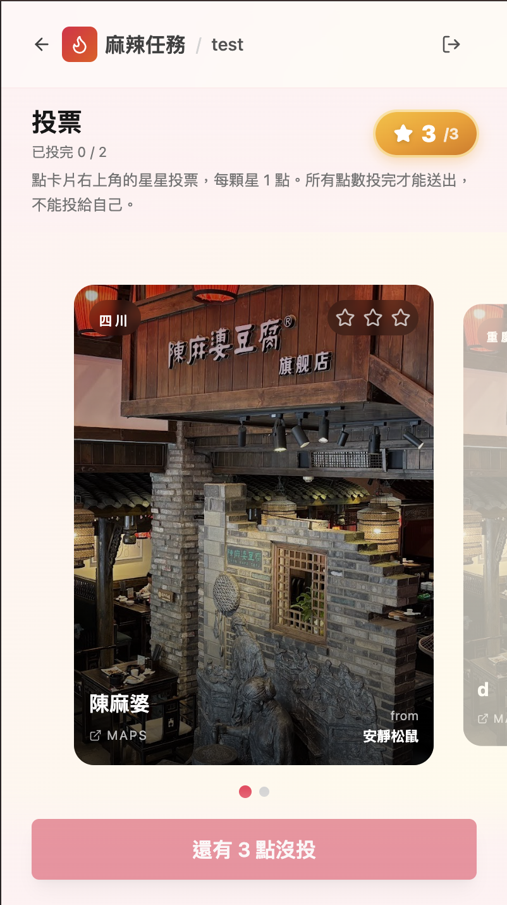

---

## 7. 確認投票

把所有點數分配完畢後，點擊「確認送出」。

**投錯了？** 沒關係，確認後還可以點「已確認，點此反悔」重新分配。所有人同時確認後才會結算。

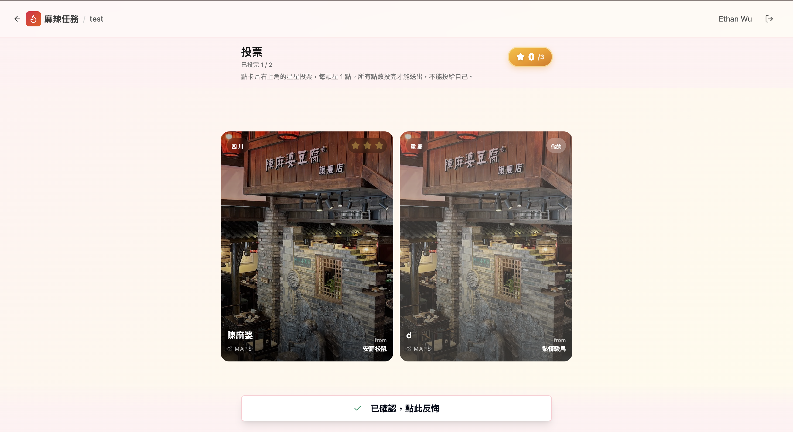

---

## 8. 投票結果

所有人確認後，進入頒獎台畫面，按照得票數排列名次。點擊頭像可以查看該餐廳的詳細資訊。

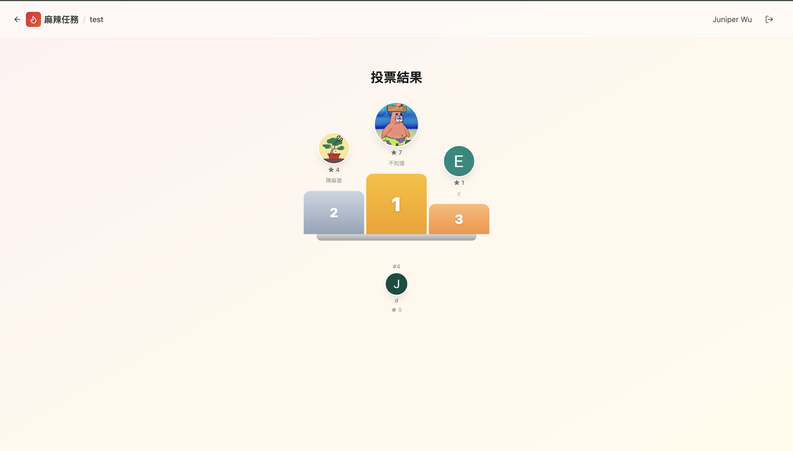

---

## 9. 排程用餐時間（房主限定）

房主可以在卡片詳情中，點擊日曆按鈕為每間餐廳設定用餐日期和時間。設定後所有人都能看到倒計時。

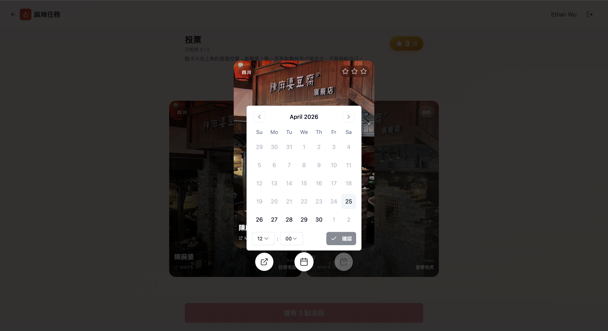

---

## 10. 加到 Google 日曆

設定用餐時間後，所有人都可以點擊日曆按鈕，一鍵將用餐資訊加到自己的 Google 日曆。

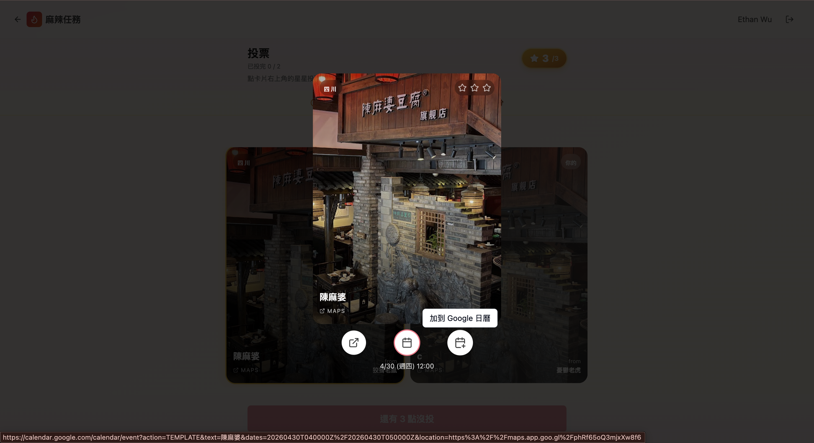
